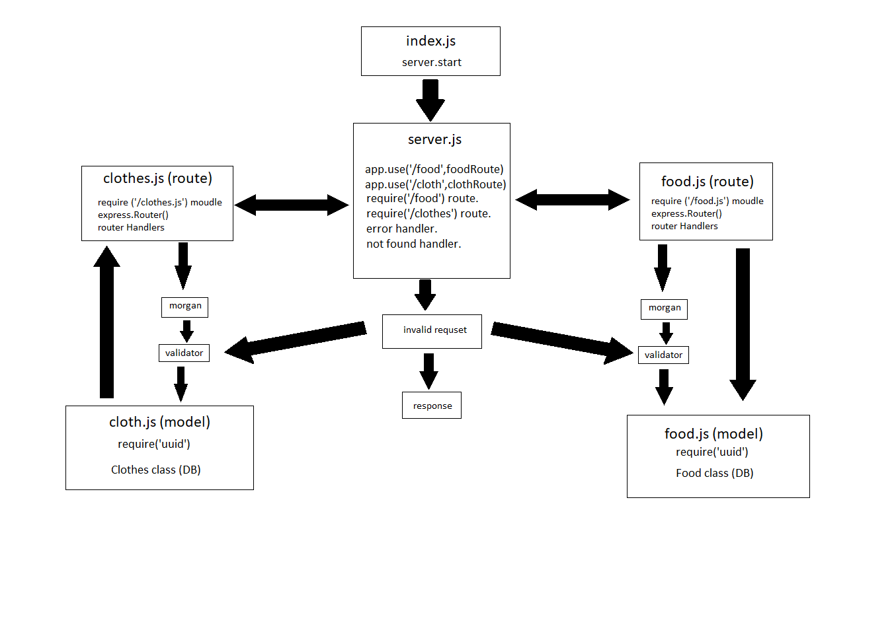

# basic api server
## Setup
* First creating the repository on github.
* Clone it on the local machine.
* npm i express dotenv cors morgan uuid jest nodemon supertest.
* Create the needed directories and files for the application.

## The end points for the Application
* ( /food ) with the GET method to get all the food in the database.
* ( /food ) with the POST to create a food in the database.
* ( /food/:id ) with the GET method to get one food by id.
* ( /food/:id ) with the PUT method to update one food by id.
* ( /food/:id ) with the DELETE method to delete one food by id.

* ( /cloth ) with the GET method to get all the cloth in the database.
* ( /cloth ) with the POST to create a colth in the database.
* ( /cloth/:id ) with the GET method to get one cloth by id.
* ( /cloth/:id ) with the PUT method to update one cloth by id.
* ( /cloth/:id ) with the DELETE method to delete one cloth by id.

## Middleware in the Application 
* morgan.
* validator for checking if the request has an id params.

## Heroku Deploying Url's

[Heroku main](https://hamza-basic-express-server.herokuapp.com/person?name=validName)

## Github Test
[Github Actions](https://github.com/hamzashamoun96/basic-express-server/actions)

## Github Pull Request
[Pull Request](https://github.com/hamzashamoun96/basic-express-server/pull/1)

## Test
* for testing the application run the command npm test.

## UML 
